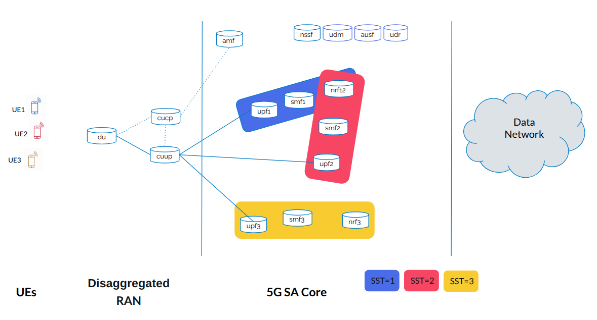

# OAI 5G SA Core and Disaggregated RAN Deployment on Kubernetes using Helm Charts – Slicing Scenario

<div align="center">
    
</div>

## Overview

This repository provides a deployment of the OpenAirInterface (OAI) 5G Standalone (SA) Core with network slicing, using a Disaggregated Radio Access Network (RAN) architecture. The RAN includes an OAI Central Unit (CU) split into Control Plane (CU-CP) and User Plane (CU-UP) components, an OAI Distributed Unit (DU), and multiple OAI NR-UEs, each assigned to a specific S-NSSAI (Single Network Slice Selection Assistance Information). Network slicing is applied at the core level, ensuring that different UEs are routed through their respective slices.

A Network Slice consists of 5G Core and 5G RAN components, all defined within a PLMN. A slice is identified using S-NSSAI, which consists of:

- Slice/Service Type (SST): Defines the expected slice behavior (e.g., eMBB, URLLC, mMTC, V2X).

- Slice Differentiator (SD): Optionally differentiates slices within the same SST.

Each UE can connect to up to eight (8) slices simultaneously. SST values range from 0 to 255, with: SST 1 = eMBB, SST 2 = URLLC, SST 3 = mMTC, SST 4 = V2X, SST 5-127: Reserved for experimental use and SST 128-255: Reserved for operators



### **Network Slicing Configuration**

The slicing structure follows the setup illustrated in the figure above.

- **Slice 1 (Blue) [SST=1]**:
  - **Core Components**: NRF12, SMF1, UPF1
  - **UEs**: UE1 (via gNB1)
- **Slice 2 (Red) [SST=2]**:
  - **Core Components**: NRF12, SMF2, UPF2
  - **UEs**: UE2 (via gNB1)
- **Slice 3 (Yellow) [SST=3]**:
  - **Core Components**: NRF3, SMF3, UPF3
  - **UEs**: UE3 (via gNB1)

The common **AMF, NSSF, UDM, UDR, AUSF** components serve all slices. SMF and UPF in **Slice 1 and Slice 2** share the same NRF, making both UPFs discoverable by both SMFs.

Note that SSTs are only for numerical reference and does not reflect standard SST behaviour e.g. eMBB, URLCC, mMTC, V2X etc.

## Contributors

- Yasser BRAHMI, abdenour-yasser.brahmi@telecom-sudparis.eu
- Massinissa AIT ABA, massinissa.ait-aba@davidson.fr


# Build a K8S cluster
We assume that a Kubernetes cluster is already running using this repository: https://github.com/AIDY-F2N/build-k8s-cluster

# OAI 5G SA Core

We present the different steps to deploy the OAI core. 

1.  Install the Helm CLI usnig this link: https://helm.sh/docs/intro/install/

Helm CLI (Command-Line Interface) is a command-line tool used for managing applications on Kubernetes clusters. It is part of the Helm package manager, which helps you package, deploy, and manage applications as reusable units called Helm charts.

Helm provides a straightforward way to define, install, and upgrade complex Kubernetes applications. With Helm, you can define the desired state of your application using a declarative YAML-based configuration file called a Helm chart. A Helm chart contains all the necessary Kubernetes manifests, configurations, and dependencies required to deploy and run your application.

2.  Install Helm Spray using this command: 
```bash[language=bash]
helm plugin install https://github.com/ThalesGroup/helm-spray
```
Helm Spray is a Helm plugin that simplifies the deployment of Kubernetes applications using Helm charts. Helm is a package manager for Kubernetes that allows you to define, install, and manage applications as reusable units called charts. Helm Spray extends Helm's functionality by providing additional features and capabilities for managing the lifecycle of complex deployments. The command helm plugin install installs the Helm Spray plugin, enabling you to use its functionalities alongside Helm.

3. Clone this GitHub repository
    ```bash[language=bash]
    git clone https://github.com/k8snetworkplumbingwg/multus-cni.git
    ```

- Apply a daemonset which installs Multus using kubectl. From the root directory of the clone, apply the daemonset YAML file:
    ```bash[language=bash]
    kubectl apply -f multus-cni/deployments/multus-daemonset-thick.yml 


    kubectl delete -f ./multus-cni/deployments/multus-daemonset-thick.yml

    ```
4. Create a namespace where the helm-charts will be deployed, in this tutorial, we deploy them in oai namespace. To create oai namespace use the below command on your cluster: 
    ```bash[language=bash]
    kubectl create ns oai
    ```

5. Clone the following repository:
```bash[language=bash]
git clone https://github.com/AIDY-F2N/5G-SA-Split-RAN-Slicing-K8s.git
```
6. Open a terminal inside the folder "5G-SA-Split-RAN-Slicing-K8s", and run the following commands to deploy the OAI core:
```bash[language=bash]
helm dependency update 5g_core/oai-5g-advance/
helm install 5gc 5g_core/oai-5g-advance/ -n oai
```
The two commands you provided are related to the Helm package manager and are used to manage and deploy Helm charts onto a Kubernetes cluster. 
After this, run this command to check if the core is deployed: 
```bash[language=bash]
kubectl get pods -n oai 
```


# OAI Disaggregated 5G RAN
This setup launches the RAN components (OAI CU-CP, CU-UP, and DU) with SST support from 1 to 3, and deploys three OAI nrUEs, each configured with a different SST:

```bash[language=bash]
helm install cucp 5g_ran/dis_ran_gnb1/oai-cu-cp/ -n oai
helm install cuup 5g_ran/dis_ran_gnb1/oai-cu-up -n oai
helm install du 5g_ran/dis_ran_gnb1/oai-du -n oai

helm install nrue1 5g_ran/oai-nr-ue1 -n oai 
helm install nrue2 5g_ran/oai-nr-ue2 -n oai
```

To check if the UE has an IP address:

```bash[language=bash]
kubectl exec -it -n oai -c nr-ue $(kubectl get pods -n oai | grep oai-nr-ue | awk '{print $1}') -- ifconfig oaitun_ue1 |grep -E '(^|\s)inet($|\s)' | awk {'print $2'}
```
To test connectivity with a ping:

```bash[language=bash]
kubectl exec -it -n oai -c nr-ue $(kubectl get pods -n oai | grep oai-nr-ue2 | awk '{print $1}') -- ping -I oaitun_ue1 -c4 google.fr
```

helm install ueransim-gnb 5g_ran/ueransim-gnb2/ -n oai

helm install ueransim-ue1 5g_ran/ueransim-ue1/ -n oai
helm install ueransim-ue2 5g_ran/ueransim-ue2/ -n oai
helm install ueransim-ue3 5g_ran/ueransim-ue3/ -n oai